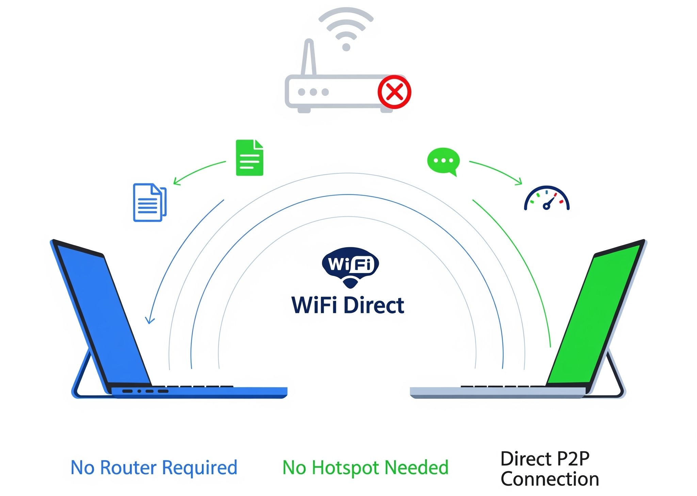
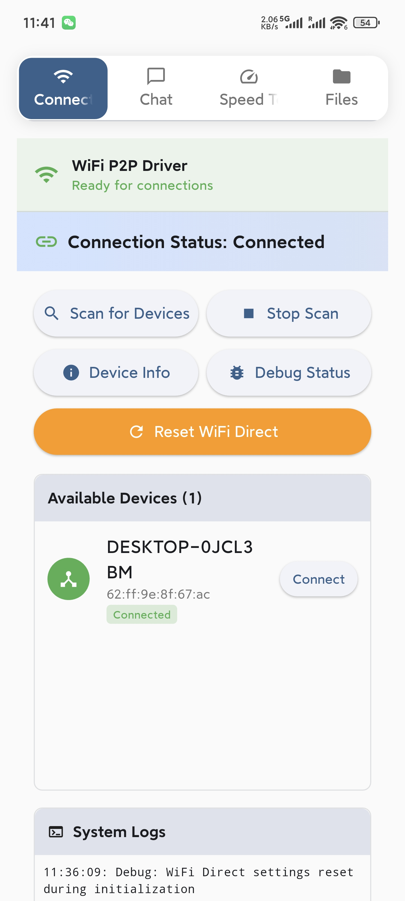
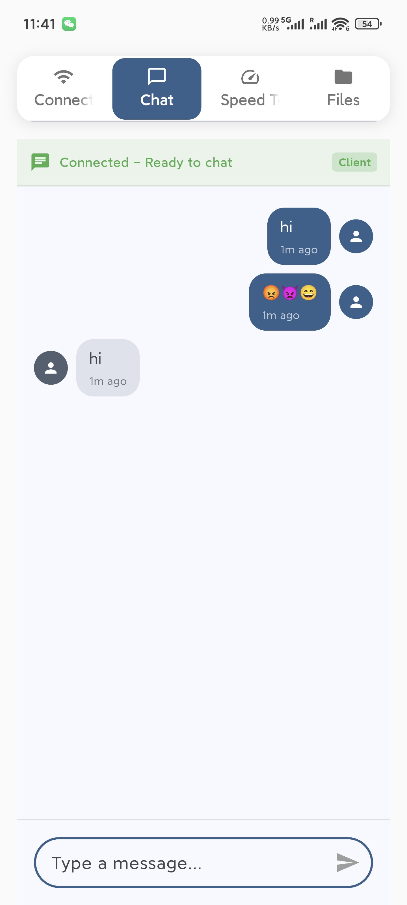
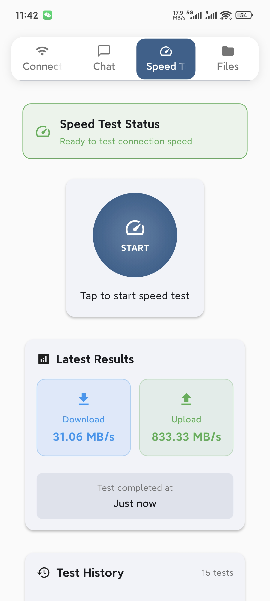
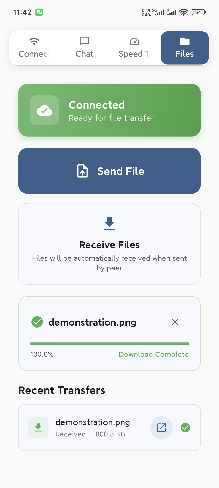

# WiFi Direct Cable


An application for seamless data, message, and file transfer using Wi-Fi Direct. No internet, no routers, just pure peer-to-peer connection that is faster and more stable than traditional methods.



---

## ✨ About The Project

WiFi Direct Cable revolutionizes file sharing by leveraging the power of Wi-Fi Direct. This means you can transfer files, messages, and data between devices without needing a central Wi-Fi network, hotspot, or any internet connection. It establishes a direct, high-speed link between devices, ensuring a transfer process that is not only incredibly fast but also exceptionally stable.

This repository contains the source code for the Android version of the application, built with Flutter.

### 🚀 Biggest Highlight

The core strength of this application is its ability to operate completely offline. By using Wi-Fi Direct, it creates a private network between devices, offering superior speed and reliability compared to other apps that rely on Bluetooth or Wi-Fi hotspots.

### 💻 Windows Version

A separate version for Windows is also available, providing the same powerful features for your desktop or laptop. You can find it here: [**Windows Version Repo**](https://github.com/jingcjie/WDCableWUI).

## 🌟 Features

*   **Direct Device-to-Device Connection**: No need for any intermediary network infrastructure.
*   **High-Speed File Transfer**: Transfer large files in a fraction of the time.
*   **Real-time Messaging**: Chat with another connected device.
*   **Data Streaming**: Send streams of data between devices.
*   **Cross-Platform**: Works on Android, with a separate client for Windows.
*   **Network Speed Test**: Check the transfer speed of your connection.

## 📸 Screenshots

|  |  |  |  |
| :---: | :---: | :---: | :---: |
| Connection | Chat  | Speed Test | File Transfer |

## 🏁 Getting Started

To get a local copy up and running, follow these simple steps.

### Prerequisites

*   Flutter SDK: [Installation Guide](https://flutter.dev/docs/get-started/install)
*   Android Studio or VS Code

### Installation

1.  Clone the repo
    ```sh
    git clone https://github.com/jingcjie/WDCable_flutter
    ```
2.  Navigate to the project directory
    ```sh
    cd wifi_direct_cable
    ```
3.  Install dependencies
    ```sh
    flutter pub get
    ```
4.  Run the app
    ```sh
    flutter run
    ```

## 🤝 Contributing

Contributions are what make the open-source community such an amazing place to learn, inspire, and create. Any contributions you make are **greatly appreciated**.

1.  Fork the Project
2.  Create your Feature Branch (`git checkout -b feature/AmazingFeature`)
3.  Commit your Changes (`git commit -m 'Add some AmazingFeature'`)
4.  Push to the Branch (`git push origin feature/AmazingFeature`)
5.  Open a Pull Request

## 📜 License

Distributed under the MIT License. See `LICENSE` for more information.

