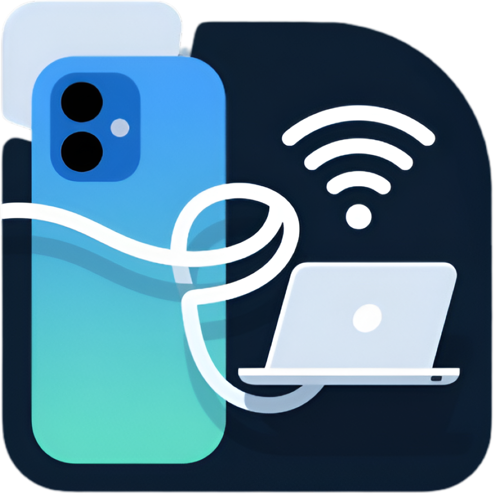
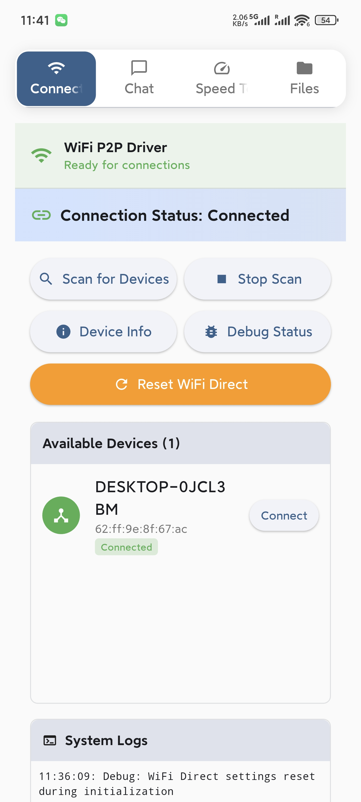
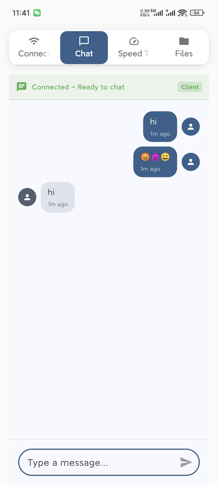
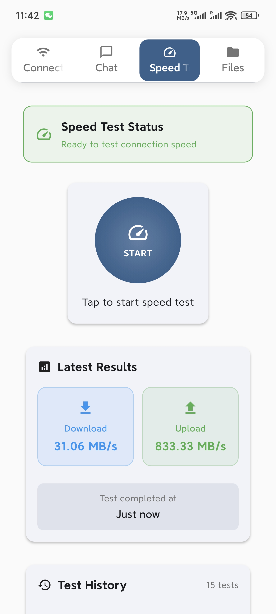
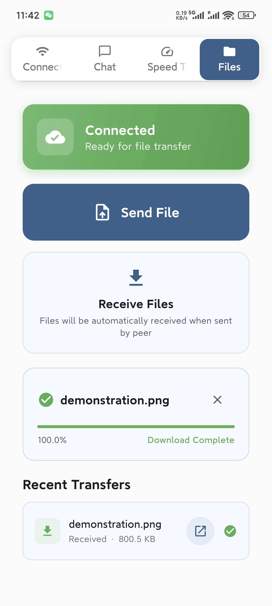

# WiFi Direct Cable

<p align="center">
  
</p>

<p align="center">
  <strong>Offline peer-to-peer transfer for files, chat, speed tests, and audio over Wi-Fi Direct.</strong>
</p>

<p align="center">
  No internet. No router. No hotspot. Just a direct device-to-device connection.
</p>

<p align="center">
  
  
  
  
</p>

## What It Does

WiFi Direct Cable creates a private local link between nearby devices using Wi-Fi Direct. Once connected, the devices share one negotiated app session for chat, file transfer, speed testing, and audio.

This repository contains the Flutter Android client. A separate Windows companion app is available here: [WDCableWUI](https://github.com/jingcjie/WDCableWUI).

## Highlights

- Direct device-to-device connection without internet access.
- High-speed file transfer for local sharing.
- Real-time chat between connected peers.
- Low-latency Audio Link using RTP/RTCP over UDP with libopus.
- Selectable audio quality and latency modes.
- Built-in upload and download speed tests.
- Protocol v2 transport with UDP rendezvous and detailed connection diagnostics.
- Android client with a separate Windows companion app.

## Audio Link Use Case

Use an Android device as a mobile microphone sender and the Windows client as the receiver. Audio Link streams libopus audio over RTP/RTCP and provides selectable quality and latency modes for different network conditions.

| Android Audio Link | Windows Audio Link |
| :---: | :---: |
|  |  |

## Screenshots

| Connection | Chat | Speed Test | File Transfer |
| :---: | :---: | :---: | :---: |
|  |  |  |  |


## What's New in 2.0.1

Version 2.0.1 is the Protocol v2 release. It separates Wi-Fi Direct group-owner/client roles from WDCable TCP listener/connector roles, uses UDP rendezvous when needed, and upgrades Audio Link to RTP/RTCP over UDP with libopus.

- More reliable Wi-Fi Direct session setup, including a fix for Windows endpoint routing issues.
- Wi-Fi Direct clients now own the WDCable TCP listeners.
- UDP rendezvous lets Android group-owner devices safely discover the peer listener endpoint.
- Expanded diagnostics for device roles, selected endpoints, rendezvous, TCP setup, and handshake failures.
- Lower-latency Audio Link streaming using RTP/RTCP over UDP and libopus.
- Sender quality presets: Standard (32 kbps), Balanced (64 kbps), High (128 kbps), and Near lossless (256 kbps).
- Sender latency modes: Low latency and Stable.
- Improved audio statistics for configured and measured bitrate, packet loss, jitter, late drops, buffer level, and RTCP reports.

> [!IMPORTANT]
> Protocol v2 is not compatible with Protocol v1. Both devices must run WDCable 2.0.1 or another Protocol v2-compatible build.
>
> Android 2.0.1 supports `arm64-v8a` and `x86_64`. The 32-bit `armeabi-v7a` ABI is not supported.


## Platform Support

| Platform | Status | Repository |
| --- | --- | --- |
| Android | Android 13+; `arm64-v8a` or `x86_64` | This repository |
| Windows | Separate companion client | [WDCableWUI](https://github.com/jingcjie/WDCableWUI) |

## Getting Started

### Prerequisites

- Flutter SDK: [installation guide](https://flutter.dev/docs/get-started/install)
- Android Studio or VS Code
- An Android device with Wi-Fi Direct support

### Run Locally

```sh
git clone https://github.com/jingcjie/WDCable_flutter.git
cd WDCable_flutter
flutter pub get
flutter run
```

## Troubleshooting

- Make sure Wi-Fi is enabled on both devices.
- Grant nearby-device, microphone, and notification permissions when Android asks.
- Keep both devices on the connection screen while pairing.
- If discovery fails, turn Wi-Fi off and on, then scan again.
- If a connection fails after updating one device, update the other device to WDCable 2.0.1 or another Protocol v2-compatible build.
- For Android-to-Windows testing, run the Windows companion app from [WDCableWUI](https://github.com/jingcjie/WDCableWUI).

## Coming Soon

- Camera and video streaming over Wi-Fi Direct.

## Contributing

Contributions are welcome. For larger changes, please open an issue first so the implementation can be discussed before a pull request.

```sh
git checkout -b feature/your-feature
git commit -m "Add your feature"
git push origin feature/your-feature
```

Then open a pull request.

## License

Distributed under the MIT License. See [LICENSE](LICENSE) for more information.
